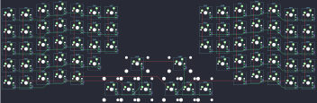

## zsa/moonlander

[layout](moonlander-kle.json) - [PCB](moonlander.kicad_pcb)

{:loading="lazy"}

[Open in keyboard-layout-editor](http://www.keyboard-layout-editor.com/##@@_x:3.5;&=0,3&_x:10.5;&=6,3;&@_x:2.5&y:-0.875;&=0,2&_x:1.0;&=0,4&_x:8.5;&=6,2&_x:1.0;&=6,4;&@_x:5.5&y:-0.875;&=0,5&=0,6&_x:4.5;&=6,0&=6,1;&@_x:0.5&y:-0.875;&=0,0&=0,1&_x:14.5;&=6,5&=6,6;&@_x:3.5&y:-0.375;&=1,3&_x:10.5;&=7,3;&@_x:2.5&y:-0.875;&=1,2&_x:1.0;&=1,4&_x:8.5;&=7,2&_x:1.0;&=7,4;&@_x:5.5&y:-0.875;&=1,5&=1,6&_x:4.5;&=7,0&=7,1;&@_x:0.5&y:-0.875;&=1,0&=1,1&_x:14.5;&=7,5&=7,6;&@_x:3.5&y:-0.375;&=2,3&_x:10.5;&=8,3;&@_x:2.5&y:-0.875;&=2,2&_x:1.0;&=2,4&_x:8.5;&=8,2&_x:1.0;&=8,4;&@_x:5.5&y:-0.875;&=2,5&=2,6&_x:4.5;&=8,0&=8,1;&@_x:0.5&y:-0.875;&=2,0&=2,1&_x:14.5;&=8,5&=8,6;&@_x:3.5&y:-0.375;&=3,3&_x:10.5;&=9,3;&@_x:2.5&y:-0.875;&=3,2&_x:1.0;&=3,4&_x:8.5;&=9,2&_x:1.0;&=9,4;&@_x:5.5&y:-0.875;&=3,5&_x:1.0&c=#777777&w:2;&=5,3&_x:0.5&w:2;&=11,3&_x:1.0&c=#cccccc;&=9,1;&@_x:0.5&y:-0.875;&=3,0&=3,1&_x:14.5;&=9,5&=9,6;&@_x:3.5&y:-0.375&c=#777777;&=4,3&_x:10.5;&=10,3;&@_x:2.5&y:-0.875&c=#cccccc;&=4,2&_x:1.0&c=#777777;&=4,4&_x:8.5;&=10,2&_x:1.0&c=#cccccc;&=10,4;&@_x:6.5&y:-0.875&h:2;&=5,0&_h:2;&=5,1&_h:2;&=5,2&_x:0.5&h:2;&=11,4&_h:2;&=11,5&_h:2;&=11,6;&@_x:0.5&y:-0.875;&=4,0&=4,1&_x:14.5;&=10,5&=10,6)

{:loading="lazy"}

